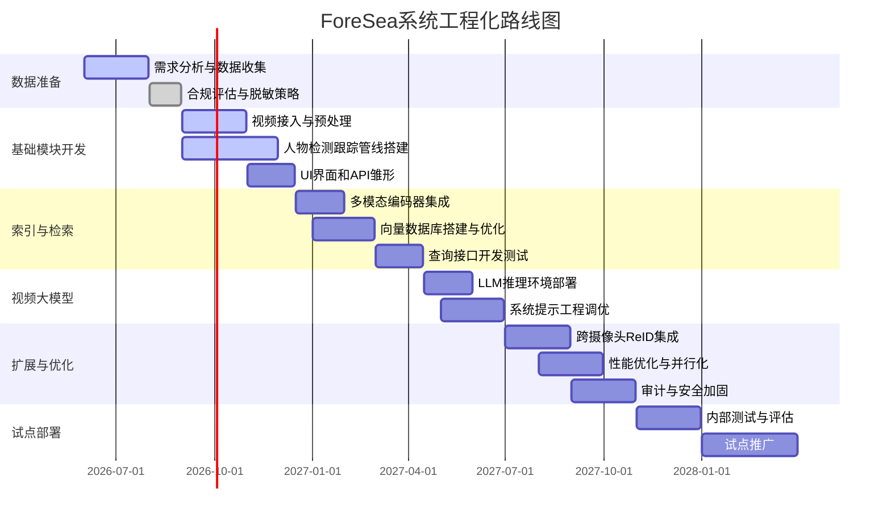

# 执行摘要

ForeSea 是 Qualcomm AI Research 团队于2026年提出的多模态视频检索系统，专门针对公安视频监控取证场景设计【29†L72-L81】【15†L2257-L2265】。其核心贡献包括：1) 发布了**ForeSeaQA** 数据集——利用 UCF-Crime 监控视频构建、包含多模式（图像+文本）查询及精确时间标注的视频问答基准【29†L72-L81】【15†L2257-L2265】；2) 提出一套三阶段检索增强生成（Video-RAG）系统 **ForeSea**：使用 **多目标跟踪** 预筛选相关人员片段，采用统一**多模态嵌入**进行索引检索，再由**视频大模型（VideoLLM）**生成答案及时序定位【29†L82-L91】【32†L404-L413】。实验证明，ForeSea 在 ForeSeaQA 基准上将准确率提升至66.0%，时序IoU达13.6%，显著优于 VideoRAG 等先前方法【34†L533-L538】；且端到端延迟仅2.6秒，低于传统检索流水线【36†L650-L659】【36†L660-L664】。本报告梳理了 ForeSea 的论文、系统结构、所用算法、数据需求与评价指标，对比了 VideoRAG 和其他多模态检索项目，分析了其在公安取证场景的适用性与风险，最后提出工程化落地路线图、推荐集成开源组件及评测方案。本报告旨在为公安部门探索基于AI的视频多模态检索技术提供全面、详细的参考。

## 论文元数据与研究概述

- **论文信息**：ForeSea 论文题目《ForeSea: AI Forensic Search with Multi-modal Queries for Video Surveillance》，发表于2026年。作者包括 Hyojin Park、Yi Li、Janghoon Cho 等11人【29†L72-L81】。论文已在 arXiv 发布（论文编号 2603.22872，DOI：https://arxiv.org/abs/2603.22872），并伴随数据集、代码和演示页面公开【15†L2331-L2340】【32†L506-L510】。  
- **创新点**：提出首个面向长时监控视频的多模态问答基准 *ForeSeaQA*，支持图像+文本复合查询与精准事件定位【29†L72-L81】【15†L2269-L2277】；同时设计了三阶段检索增强生成框架 *ForeSea*：先用人检测+跟踪提取感兴趣片段，再用统一嵌入检索相关片段，最后由视频大模型生成答案及时间戳【29†L84-L92】【32†L404-L413】。该方法通过**以人为中心的检索**，显著提高了时序定位准确性（IoU提升 11.0%），并降低了处理时延【29†L84-L92】【34†L539-L547】。  
- **论文摘要**：文中指出，传统监控检索依赖跟踪流水线或基于CLIP的模型，对复杂场景支持不足。为解决这一空白，ForeSeaQA 包含来自 UCF-Crime 的长视频问答样本，查询形式支持参考人物图像+文本提问【29†L72-L81】。ForeSea 系统包括 (1) **跟踪模块**：筛选并切割相关人物片段；(2) **多模态嵌入模块**：对各片段生成统一视觉+文本向量并索引存储；(3) **查询阶段**：将图文查询转为向量检索相似片段，再交由视频大模型生成答案与事件定位【32†L404-L413】【32†L415-L422】。实验证明 ForeSea 在 ForeSeaQA 数据集上准确率达66.0%，时序IoU13.6%，均优于 VideoRAG 等基线【34†L533-L538】；且总体检索延迟仅2.6秒，低于传统管线【36†L650-L659】。  

## 系统架构与关键模块

ForeSea 系统由两大阶段组成：**数据库构建**和**查询检索**【32†L398-L407】【32†L415-L422】。其总体流程如下：

- **（1）视频数据库构建**：对多路监控视频进行处理。首先使用**人检测+跟踪（Tracking）**模块（如 YOLOv5+ByteTrack【32†L506-L510】），将视频按人物出现的连续轨迹切分成若干**以人为中心的视频片段**（仅保留感兴趣人员的帧）。对每个片段，根据跟踪边界框裁剪出人物画面，形成“人物视频剪辑”。  
- **（2）多模态嵌入索引**：将每个剪辑送入多模态编码器（采用公开的视觉语言模型，如基于 CLIP 的模型【45†L88-L96】或 GCL/VISTA 训练得到的编码器【32†L506-L510】），对其多帧特征进行抽样编码，生成固定长度的**向量表示**。该向量与元数据（摄像机ID、时间戳、边框坐标等）一起存入向量检索库（可选用 Faiss、Milvus 等高效ANN数据库）。  
- **（3）查询与答案生成**：用户输入可为文本提问或图像+文本组合查询，统一通过同一多模态编码器生成查询向量【32†L445-L453】。系统从数据库中检索**Top-K** 相关片段，按照相关度排名返回。将这些候选剪辑拼接并输入视频大模型（VideoLLM，如 VideoLLaMA3）进行推理，模型被特别提示输出：(a) 该片段里出现关键事件的简要描述；(b) 每个事件的精确**时间戳**（起止时间）。最终系统输出准确答案及对应的证据视频片段。  

上述流程架构如图所示：  

```mermaid
graph TB
    A[监控视频流] --> B[人检测+跟踪]
    B --> C[生成人物视频剪辑]
    C --> D[多模态编码器]
    D --> E[向量检索库索引存储]
    F[查询: 图像+文本/纯文本] --> G[查询编码 (多模态编码器)]
    G --> E
    E --> H[取 Top-K 片段]
    H --> I[视频大模型（VideoLLM）]
    I --> J[答案 + 时间戳]
```

在图中，每个模块职责为：**跟踪模块**负责从长视频中提取目标人物的轨迹并切分视频【32†L404-L413】；**嵌入模块**负责对剪辑片段进行视觉+文本联合编码，并建立支持跨模态检索的向量索引【32†L433-L442】【32†L455-L462】；**检索模块**支持多模态查询，能够基于文本或图文生成的向量在统一空间检索相关片段【32†L445-L454】【32†L455-L462】；**视频大模型**用于对检索到的候选片段进行深度推理，输出答案和事件定位【32†L468-L472】。值得注意的是，为指导模型关注人员，系统在候选片段帧上绘制跟踪边界框并将坐标加入提示，增强时空定位能力【32†L465-L472】。

【52†embed_image】 图：一种视频检索管线示例。该示意图展示了将视频分为音频与视觉信息两部分进行处理的流程（来自 NVIDIA 博客）。如图所示，音频部分可通过 ASR 转为文本，视觉部分可通过降采样和帧选择提取关键信息，这些信息共同构建检索索引，并经 RAG 方案交给 LLM 生成答案【51†L218-L227】【52†L0】。虽示例聚焦讲解录像，但多媒体检索框架中的处理思想与 ForeSea 类似。  

## 关键算法与模型

ForeSea 系统的关键技术栈包括以下组件：

- **视频目标检测与跟踪**：论文中采用了 **ByteTrack** 跟踪算法，配合基于 **YOLOv5** 的行人检测器，用于对监控视频中人物进行检测与持续跟踪【32†L506-L510】。ByteTrack 以高精度和速度著称，适合长视频目标跟踪【32†L506-L510】。替代方案可使用 **CenterTrack**、**QDTrack** 等跟踪器；行人检测可选 **YOLOv8**、**RetinaNet**、**Faster R-CNN** 等。各方案在精度与实时性上有权衡：YOLOv5/v8 模型速度快但对重叠遮挡目标精度略低；检测加跟踪方案在多人环境下需要平衡漏检与误检率。考虑安防场景，可适当调整阈值或多摄像头融合提高鲁棒性。  

- **多模态嵌入编码器**：系统采用统一的视觉+语言向量空间进行检索。具体实现中，论文使用了经过 **GCL (Group Contrastive Learning)** 训练的跨模态编码器，参照 **VISTA** 框架【32†L506-L510】。该编码器能够将视频帧（图像）和文本/图文查询映射到同一向量空间。【45†L88-L96】的观点也认为，使用单一模型（如 CLIP【45†L88-L96】）来统一多模态嵌入能简化系统设计。替代方案包括 **OpenAI CLIP**、**BLIP**、**X-CLIP** 等预训练模型。需要注意，单一空间模型易扩展到多种数据，但难以兼顾所有模态的特征；跨模态对齐的训练数据规模也直接影响检索效果。  

- **文本识别与说话人识别**：虽然 ForeSea 主要使用视觉信息，但公安场景可能需要提取字幕或声音线索。可引入 **OCR**（如 PaddleOCR、Tesseract）从场景中识别文本；**ASR**（如 OpenAI Whisper、NVIDIA Parakeet【51†L237-L244】）将视频音轨转为文本，以辅助检索。若查询涉及口述命令或证人陈述，可对音频做情感分析或关键词检索。需要权衡的是，OCR/ASR 增加系统复杂度和处理时间，但能捕获额外信息。  

- **向量检索库**：将剪辑向量存入索引数据库，支持近似最近邻检索。常用开源方案包括 **FAISS**（Facebook）和 **Milvus**（Zilliz），后者在云端部署和分布式检索上更友好。选择时应考虑检索规模（数万视频或更高）与实时性需求。  

- **大语言模型 (VideoLLM)**：ForeSea 在论文中使用了**VideoLLaMA3**（7B 参数版本）作为推理模型【32†L506-L510】。VideoLLaMA3 是基于 LLaMA 的多模态版本，擅长处理视频内容。其他可选模型包括 **LLaVA-OneVision**、**GLM-4.1V**、**InternVL3**、**Qwen2.5-VL** 等【32†L497-L504】【34†L523-L531】。不同模型在参数量、能力和适用场景上各有利弊：较大模型（如 VideoLLaMA3-72B）理解能力强但计算量大；较小模型部署门槛低但可能丢失细节。ForeSea 的实验也评估了这些模型在该任务上的表现【34†L523-L531】。  

- **检索增强生成 (RAG) 架构**：ForeSea 属于视频检索增强生成范式。与传统仅基于文本检索的 RAG 不同，它检索视频片段并融合多模态信息【34†L523-L531】。相比之下，如 NVIDIA **VideoRAG** 则提出双通道架构（图形化文本知识+多模态上下文编码）对极长视频进行检索【20†L281-L290】【16†L71-L79】。其他类似工作还包括香港大学提出的 VideoRAG 系统（开源项目 **Vimo-Desktop**【41†L265-L274】）以及 LLM-Powered Video Search（SOICT 2024，侧重整合多种检索方法并引入 RAG【22†L271-L279】【24†L174-L182】）。ForeSea 区别在于首创性地使用**人物中心检索**（person-centric）策略，对监控场景效果显著【29†L84-L92】【34†L539-L547】。

## 数据需求与标注

ForeSeaQA 数据集专为多模态监控问答设计，其构建过程具参考意义【15†L2293-L2300】【15†L2300-L2304】：

- **数据来源**：使用 UCF-Crime 监控视频集作为源数据【15†L2300-L2304】。UCF-Crime 包含 128 小时、1900 视频的监控录像，涵盖多种违法犯罪场景，是唯一一个大规模监控类公开集【15†L2300-L2304】。该集原本用于异常检测研究，但采样适合构造问答素材。实际部署时，公安部门可利用自己部署的监控数据库，或类似公共安全摄像头采集的视频。

- **标注内容**：ForeSeaQA 主要包含多模态问答对，结合了六大子任务：**Search（搜索）、Activity（活动）、Event（事件）、Temporal（时序）、Counting（计数）和 Anomaly（异常）**【15†L2282-L2290】。每条样本包括：参考人物图像（提取自视频中对应人物实体的帧）+问文本描述，问题答案为多选或是/否形式；并附带「关键事件」的起止时间标注【15†L2257-L2265】【15†L2269-L2272】。标注流程由半自动化引擎完成：首先用视频中生成的**稠密字幕**提取“人物实体”，为其裁剪参考图像；再用模板驱动生成问答并标记时段【15†L2293-L2300】；最后人工校验问题有效性、答案正确性及时间标注。该流程可作为参考方案，但实际项目中需要结合目标场景进行调整。例如中国公安视频可能涉及多摄像头视角，需要额外的跨镜头标识（ReID）才能构造正确的视频片段。  

- **标注规模**：ForeSeaQA 目前规模未详细公布，但 UCF-Crime 本身128小时、1900视频【15†L2300-L2304】。人工验证确保问答质量，但标注工作量仍相当大。对公安场景而言，若构建类似数据集，应采集真实监控录像，利用自动检测和语言模型辅助生成问答，再由专家审核。需注意，人像信息隐私问题：采集视频时应确保法律依据（例如公共安全需要）并尽可能做脱敏处理；标注数据须严格控制授权范围和使用目的。根据中国相关法规（如新《个人信息保护法》），未经同意不得公开分享含个人身份特征的视频数据，需要在系统设计中考虑**安全隔离与使用权限**管理。  

- **法律与合规**：公安系统使用监控视频应遵守国家法规。2025年出台的《公共安全视频图像信息系统管理条例》强调在提升公共安全同时要保护个人隐私【61†L72-L77】；视频系统建设需依法履行审批、标识告知、隐私保护等义务。在技术实现上，应设计审计日志、访问权限控制和脱敏过滤（例如遮挡人脸、车牌）措施，确保检索和取证操作在**合法合规的链条**内完成。证据使用方面，要留存完整的**取证链（chain-of-custody）**记录，必要时可借助可信时间戳等技术保证视频内容未被篡改【58†L83-L85】。

## 性能指标与实际预期

在论文和实验中，主要关注以下指标：

- **检索/回答准确率 (Accuracy)**：即模型在多选问答上的正确率百分比【34†L539-L547】。ForeSea 在 ForeSeaQA 上取得66.0%的整体平均准确率（多模态查询与纯文本查询的平均）【34†L533-L538】，其中搜索任务准确率尤高（72.0%）【33†L28-L33】。相比之下，VideoRAG 等基线准确率约62–63%【34†L533-L538】。该指标反映最终取证答案的准确程度。

- **时序定位精度 (Temporal IoU)**：衡量预测答案关联的视频时间区间与标注真值区间的重叠程度【34†L539-L547】。IoU 越高，说明模型能给出更精确的证据片段。ForeSea 平均 IoU 为13.6%，大幅领先 VideoRAG 的3.5%【34†L533-L538】。部分任务（Search）IoU也显著提高（ForeSea-Global模式下高达16.1%【36†L662-L664】）。然而整体IoU值仍偏低，表明时序定位仍具挑战性。在公安应用中，高 IoU 意味着提供的视频片段更可信，误判率更低。

- **检索性能**：论文没有直接报告检索召回率/Precision@K等，但在附录中提到检索正确率指标（Top-IoU）【43†L1040-L1049】。一般而言，多模态检索系统也可关注召回率（retrieval @K）等指标。公安场景可设计若干检索测试，如给定查询检索到正确视频片段的比例。

- **延迟 (Latency)**：包括检索时间和生成时间，影响系统实时响应能力。ForeSea 的端到端平均延迟仅2.6秒（包含检索0.5s、生成2.1s）【36†L650-L659】。相比之下，纯VideoLLM（VideoLLaMA3）耗时3.8秒，传统 VideoRAG 耗时5.2s–7.6s【36†L657-L664】。更优化的ForeSea-Global变体（TopK+降采样）甚至仅1.4秒【36†L657-L664】。在实际部署时，若要支持快速案件响应，系统应争取低于几秒级的检索时延。硬件上，可以采用 GPU 加速（例如 VideoLLM 推理要求数个RTX 3090/4090等），并优化检索管道以并行化查询。

- **可扩展性指标**：在开放域测试（如 VideoMME、MLVU）中，ForeSea 在使用半帧的视频下性能与基线相当【36†L678-L686】。可见其检索框架在其他领域也具备一定泛化性。系统工程上，应测试对不同分辨率、码率、摄像头数量的适应能力，以及索引规模扩展后的性能变化（例如千小时级视频需多少存储、检索响应）。

## 可重现性与资源评估

虽然 ForeSea 本身尚无公开代码，相关组件都基于开源工具或模型。复现工作可分为几个部分，所需资源与费用如下示例：

| 模块                | 实现方式或依赖                          | 工时/难度        | 基础设施        | 估算成本      |
|---------------------|-------------------------------------|---------------|-------------|-----------|
| **视频处理**         | FFmpeg（帧提取）、OpenCV | 中等（1-2周）     | CPU、存储      | $500（存储） |
| **目标检测与跟踪**   | YOLOv5/v8, ByteTrack        | 中（1-2周）    | GPU (RTX3090) | $500（1-2个月GPU） |
| **多模态编码器**     | 预训练CLIP/GCL模型           | 中（2周）        | GPU          | $500         |
| **向量索引库**       | FAISS 或 Milvus           | 低（1周）        | CPU/GPU可选   | $300         |
| **查询接口与前端**   | FastAPI/Django + React/Vue  | 高（2个月）      | Web服务器     | $1000        |
| **视频大模型推理**   | VideoLLaMA3 (7B)           | 高（2周调试）    | GPU Cluster   | $2000（多卡或云GPU租用） |
| **系统集成测试**     | 性能调优、安全测试          | 高（1月）        | 多机部署测试   | $1500        |

注：成本为粗略预算，包括云资源（GPU租用、存储），不含人力费。总体估算：PoC原型约需1–2万美金，工程化部署（可同时服务数十路摄像头）可能上升到数万至十万美元级别，具体取决于接入视频量、并发需求和安全合规要求。

## 安全性与取证合规

在公安取证场景中，系统需保障视频与数据全程可信：

- **防篡改与证据链**：应对原始视频进行哈希签名、时间戳保护等，确保数据未被篡改。**可信时间戳**可证明电子数据在某一时刻的完整性与存在性【58†L83-L85】。在提取证据片段后，需记录完整的**取证流程日志**（包括提问内容、检索结果、模型输出等），以便审计。数据库和文件存储应开启写入保护和访问日志，防止未授权更改。  
- **法律合规**：如前所述，新规《公共安全视频图像信息系统管理条例》强调对监控系统进行分类监管、需要设置提示标识、数据保护等【61†L72-L77】【61†L106-L113】。系统开发与使用应严格遵守该条例和《个人信息保护法》等法律，不得非法采集、公开或滥用监控图像。  
- **隐私保护**：检索过程中可能涉及大量个人图像数据，应进行必要**脱敏**（如遮蔽非目标人脸）和**访问控制**。系统应对用户身份和操作进行日志审计，只有经授权人员才能查看具体视频内容，避免内部滥用。  
- **抗对抗攻击**：应警惕对手可能对监控视频进行干扰（如攻击模型或篡改边框数据）。模型推理阶段可增加验证（如对同一查询做多次检索以检测结果一致性）。同时保持算法更新，检测模型可能的漏洞。  
- **司法可接受性**：输出的答案和证据片段需有明确来源和时间戳，以便作为法庭证据。回答应附带指向原视频的证据片段，避免仅口头描述。系统应允许导出“不包含AI生成内容提示”的原始片段，以满足法官对证据真实性的要求。  

## 工程化路线图

为将 ForeSea 技术落地至公安系统，可按以下阶段推进：

1. **需求分析及数据准备（1-2月）**：与公安部门沟通典型检索需求，收集示例监控视频与查询案例。确定隐私合规要求并进行安全评估。建立初步任务列表（如人物搜索、事件追踪等）。

2. **基础模块开发（2-4月）**：  
   - 实现视频流接入与预处理（转码、关键帧提取）。  
   - 部署人物检测（YOLOv5）+跟踪（ByteTrack）管线，验证跟踪的精度和速度。  
   - 构建简单 UI 或API，能可视化跟踪结果及查询流程。  

3. **索引与检索实现（4-6月）**：  
   - 训练或选用多模态嵌入模型（如 CLIP + 微调），对轨迹片段生成向量。  
   - 搭建向量数据库，测试不同索引方案的查询速度和准确率。  
   - 开发查询接口：支持上传参考图像+输入查询文本，返回候选片段列表。

4. **视频大模型集成（6-8月）**：  
   - 选定并部署 VideoLLaMA3 或其他视频LLM，在GPU上搭建推理环境。  
   - 设计系统提示模板，使模型输出答案和时间戳。测试模型在检索片段集合上的表现，并与预期比对。  

5. **多摄像头与跨镜头关联（8-10月）**：  
   - 扩展跟踪模块支持**跨摄像头ReID**：同一人跨镜头的轨迹关联。可整合多摄像头视角网络，确保同目标连续追踪。  
   - 考虑地图拼接：在检索结果中给出目标路径地图视图。  

6. **系统优化与审计日志（10-12月）**：  
   - 优化性能：并行化查询、分布式部署向量库。  
   - 增加审计功能：记录每次检索和结果供后续审计。  
   - 安全加固：用户权限管理、输入过滤、防止模型被恶意询问或操纵。  

7. **试点部署与评估（后续）**：部署在有限场景（如某分局）进行试点，收集用户反馈与统计指标（检索速度、准确率、误报率）。后续根据评估结果迭代改进，并规划大规模推广。  

上述过程可通过甘特图展示任务与时间节点：  

此路线图分阶段清晰安排了从需求调研、核心开发到部署验收的过程，并预留了优化与试点评估阶段，确保系统设计符合公安实际需求。各阶段需密切与业务部门沟通，及时调整设计。

## 推荐开源项目与评测数据集

**推荐整合的开源项目**：

- **VideoRAG (HKUDS/Vimo Desktop)**【41†L257-L265】【20†L281-L290】：香港大学提出的视频检索-生成框架，支持超长视频对话。其开源实现 `VideoRAG` 提供了完整的动态视频检索、帧选择和多模态RAG算法【20†L281-L290】。对于需要开放域视频对话或超长纪录片分析的场景十分适用，其检索策略和UI（Vimo）可借鉴。  
- **LLM-Powered Video Search**【22†L271-L279】【24†L174-L182】：越南团队在 AIC2024/SOICT2024 上发表的项目，集成了多种检索方式（文本、图像、元数据）与 RAG 架构【22†L271-L279】【24†L174-L182】。其 GitHub 实现支持用户图形化查询和多维检索，有助于快速构建原型。可参考其**组合检索得分**算法（Combined Ranking Score）以及系统架构【22†L271-L279】。  
- **InternVideo**【27†L268-L278】【27†L303-L312】：上海 AI 实验室开源的视频基础模型库，包含多个大规模视频-语言模型（InternVideo2、InternVideo2.5 等）。可用于替代或补充 ForeSea 中的多模态嵌入和 LLM 部分。若引入 InternVideo-Next 或其它版本，可提升对复杂视频理解任务的能力。  
- **Twelve Labs Embeddings & Milvus**：Twelve Labs 提供统一的多模态嵌入模型，支持文字、图像、视频等【54†L3-L6】；Milvus 是分布式向量数据库，可扩展到亿级向量检索。二者结合可构建高效的视频检索索引。  
- **可视化与可操作工具**：如 NVIDIA Triton Inference Server、LangChain/RAG 框架，可加速模型部署。OCR 与 ASR 推荐使用 PaddleOCR、OpenAI Whisper 等成熟开源项目。前端可用 **Vimo-Desktop** 或简单开发 React/Vue UI。  
- **监控取证工具**：可集成**可信取证平台**（如 TSA 平台）提供的时间戳和加签功能【56†L144-L152】。链式调用可靠存证服务，保证证据效力。  

**评测数据集与基准**：  
- **ForeSeaQA**：首选自行构建或使用 ForeSeaQA 来评测系统多模态检索效果【15†L2257-L2265】。  
- **UCF-Crime**：可用于检索异常事件，作为视频库基础【15†L2300-L2304】。  
- **VideoQA 基准**：如 **VideoMME**、**MLVU**【36†L692-L702】，可用于测试系统在开放域（一般视频）上的表现。利用上述公开长视频问答数据（TopicQA、NExT-QA、TGIF-QA 等）也可进行多样化评测。  
- **轨迹跟踪基准**：若使用跟踪模块，可评测如 MOT17、PandaSet 等跟踪数据集，以验证跟踪性能。  
- **安全漏洞测试**：可以参考 AI 审计基准（如 SLM Checks）进行系统安全测试。  

## 风险与缓解策略

- **模型不确定性与误判**：视频大模型可能产生**虚构答案**或定位错误，尤其在遇到检索到错误片段时。缓解方法包括：限制输出格式（强制多选，检测不合理输出）、后端加入验证层（如事实检查），或在人机交互中提示“未找到答案”选项。  
- **多摄像头匹配失败**：在多人、跨镜头场景中，跟踪与ReID失败会导致遗漏关键片段。需提高跟踪鲁棒性，如训练特征ReID模型结合服装、姿态信息；或使用全景几何约束融合多视角。  
- **数据偏差**：ForeSeaQA 数据基于监控视频构造，可能与实际场景差异，如光照、摄像头质量、监控场景（商场、街道、学校等）不同。应尽量使用与本地场景贴近的视频进行微调或扩充样本，以减少领域差距。  
- **隐私合规风险**：系统处理个人图像时必须严格合规。对策包括权限管理、隐私脱敏、数据最小化原则；确保任何输出的证据片段只暴露关键信息，不泄露无关隐私（如行人其他身份信息）。  
- **操作与解释性**：技术生成的答案需可解释以满足司法质证。要在系统中清晰标注证据来源和时间片段，避免仅用“模型语言”回答。若可能，提供多个候选答案和置信度，供分析人员判断。  

**比较表：ForeSea vs VideoRAG vs LLM-powered**  

| 特性 / 框架                    | ForeSea (本报告)          | VideoRAG (HKUDS/Vimo)        | LLM-Powered (SOICT2024)   |
|-------------------------------|---------------------------|----------------------------|--------------------------|
| 查询形式                       | 图像+文本 / 纯文本        | 纯文本（多轮对话）         | 图像+文本 / 文本 / 元数据  |
| 支持领域                       | 公安监控视频（特人物检测） | 开放域视频长文档             | 多媒体检索（多模态）       |
| 检索策略                       | 以人为中心的多模态嵌入检索  | 双通道架构（图文+视频）检索 | 组合检索评分（多模态）      |
| 视频理解                      | 视频LMM（VideoLLaMA3）    | 视频LMM（作者提供几种）      | LLM + 多检索结果融合       |
| 开源实现                       | 暂无公开代码               | 已开源（Vimo Desktop）【41†L259-L268】 | 已开源（GitHub 项目【22†L271-L279】） |
| 多摄像头支持                   | 规划支持（需ReID扩展）      | 不专门设计多摄像头          | 可扩展（依赖应用设计）     |
| 实时/延迟性                    | 较低（可达秒级）          | 高（针对长视频）            | 中等（依赖硬件）          |
| 部署复杂度                     | 高（需整合多模型+安全策略） | 中等（桌面应用演示）         | 低（Django/FLASK Web服务） |
| 研发布局                       | 2026年论文提出            | 2025年论文及工具发布        | 2024年会议论文发布         |

通过此表可见：ForeSea 专注公安场景、融合图像查询且强调时序定位；VideoRAG 着眼通用极长视频对话；LLM-Powered 视频搜索侧重多模态检索集成。可根据实际需求选择技术路径。

## 结论与建议

ForeSea 提供了一个具有创新性的多模态检索框架和基准，为公安视频取证场景提供了新思路。其**以人为中心的检索策略**显著提升了时序定位能力，对目标人物问答尤其有效【34†L533-L538】【34†L539-L547】。为了尽快部署此类系统，建议：

- 立项构建先期 PoC：基于现有开源工具（如 YOLO、ByteTrack、CLIP、VideoLLaMA3）快速搭建管道，对公安自有视频数据做初步实验。  
- 数据积累和标注：利用现有安全摄像头网络，按业务场景分类采集视频素材，参考 ForeSeaQA 标注流程准备问答对，并逐步扩大数据量。  
- 集成成熟组件：利用 VideoRAG/Vimo、LLM-Powered Search 等开源项目的成果，如检索-生成技术和前端展示，可节约开发成本。向量数据库选型上推荐 Milvus 等易扩展方案。  
- 强化链式管理：在系统设计初期就规划好数据与证据的完整链路（时间戳记录、日志审计、防篡改存储），以满足**司法规范**要求【58†L83-L85】【61†L72-L77】。  
- 定期评测：使用 ForeSeaQA 及其他常用视频QA 数据集进行评测，持续监控模型准确率和定位IoU变化，及时优化算法与流程。  

综上所述，ForeSea 展示了**多模态视频检索**技术在取证分析中的潜力。下一步应积极进行跨学科合作，将算法研究成果工程化、合法化地融入公安业务系统，不断迭代升级，为执法人员提供强大的智能检索工具。

